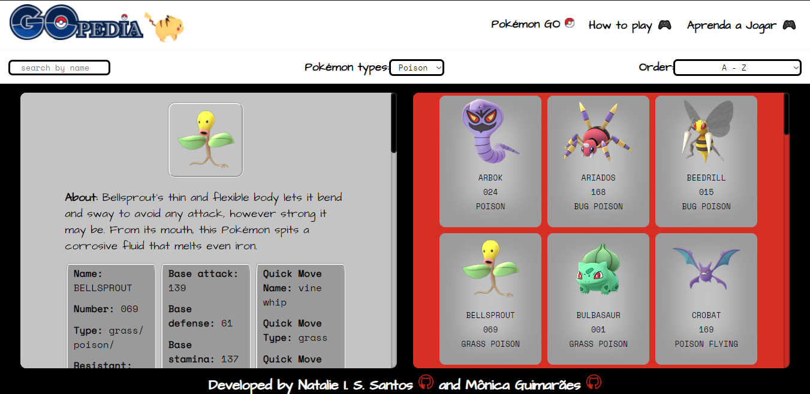
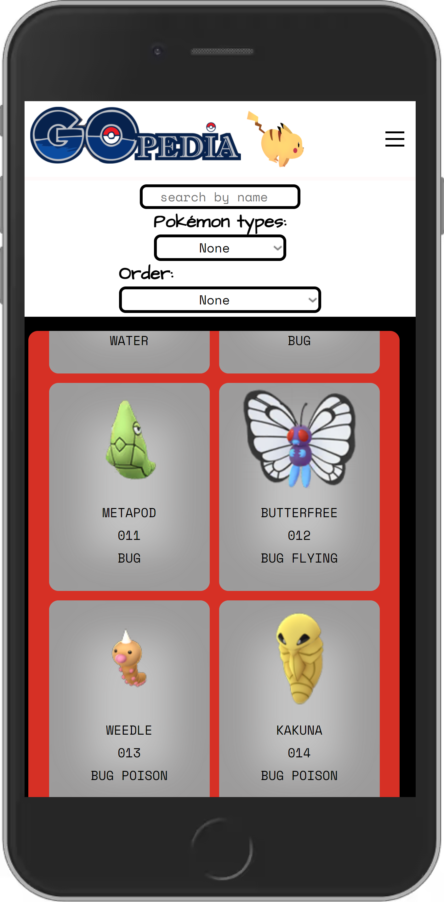

## Índice

- [DATA-LOVERS](#DATA-LOVERS)
- [Resumo do Projeto](#Resumo-do-Projeto)
- [Interface do Usuário](#Interface-do-Usuário)
- [Usuário](#Usuário)
- [Logo](#Logo)
- [Protótipo](#Protótipo)
- [Testes de Usabilidade](#Testes-de-Usabilidade)
- [Testes Unitários](#Testes-Unitários)
- [Deploy](#Deploy)
- [Recursos utilizados](#Recursos-utilizados)
- [Autoras](#Autoras)

# DATA-LOVERS

Dados por si só não são considerados informações, em um contexto onde os últimos anos foram os anos que mais geraram dados, desta forma, é necessário pensar que os mesmos fora de contexto podem confundir usuários que tentam lê-los.

O Projeto Data-Lovers da Laboratória propõe criar uma interface e trabalhar com esses dados soltos para que os dados virem informações legíveis por usuários na internet.

# Resumo do Projeto

No nosso segundo projeto, denominado data-lovers, tivemos a chance de escolher o tema de dados que iriamos trabalhar e optamos por um projeto baseado em Pokemon em razão de grande afinidade.

Neste projeto trabalhamos com um banco de dados robusto, manipulação de objetos dentro de arrays e matrizes de arrays.

Inicialmente, utilizamos as histórias de usuário fornecidas pela Laboratória e com base nesses dados traçamos as estratégias necessárias para melhorar a experiência dos usuários e atender suas expectativas. Após essa etapa, criamos uma série de tarefas para atingir os objetivos determinados pelos usuários.

Criamos também protótipos e nos organizamos através do aplicativo web Trello. Os protótipos foram utilizados para recolher avaliações de possíveis usuários bem como seus feedbacks.

# Interface do Usuário

1. Mostra os dados em uma interface: em cards;
2. Permite ao usuário interagir com a interface para obter as informações que
   necessita;
3. Permite ao usuário fazer uma filtragem por tipo e nome;
4. Permite ao usuário ordenar de A-Z, Z-A, por Chance de Spawn, Fraqueza e Numeração;
5. Permite ao usuário visualizar a porcentagem dos tipos e raridade;
6. A interface é responsiva;
7. O aplicativo Web possui dua páginas interativas: homepage e a pokédex;

## Usuário

O universo pokémon foi criado em 1995 e, ainda atualmente, é visto como uma "febre mundial" que cresceu ainda mais com a criação da franquia de Pokémon Go, responsável por trazer o mundo dos monstrinhos para a interface dos dispositivos móveis ampliando ainda mais o público alvo.

Desta forma, o presente aplicativo web é destinado a usuários de todas as idades que acompanham tanto a franquia de games quanto as séries de Pokémon. Também é destinado a novos usuários, tendo como principal objetivo proporcionar uma experiência única e divertida para todos incluindo também a sensação de nostalgia por tratar-se de uma interface intuitiva e relativamente simples que remete ao padrão de formatação dos games de Game Boy Color, com botões e overflow que lembram os aplicativos antigos de Windows 98.

As histórias de usuário ja encontravam-se pré definidas e disponibilizadas no repositório de proposta do projeto da Laboratória. Contudo, acrescentamos a história de usuário 6.

<b>História de Usuário 1 -</b> "Os Pokémons têm características únicas que determinam as decisões tomadas pelo usuário (tipo, fraqueza, peso, multiplicador, etc.)."

<b>História de Usuário 2 - "Um mestre Pokémon antes de sair para caçar os Pokémons tem que conhecer os 10 principais Pokémons que aparecem com mais frequência."

<b>História de Usuário 3 -</b> "Os Pokémons têm diferentes tipos e fraquezas em combate. Estas características são importantes na escolha do Pokémon mais adequado para sua batalha. Às vezes, você tem que escolher aqueles com menos fraquezas e saber de que tipo eles são. Portanto, é importante que um mestre de Pokémon seja capaz de ordená-los por essas 2 características."

<b>História de Usuário 4 -</b> "Os Pokémons evoluem e é importante para um mestre Pokémon saber quantas e quais evoluções eles têm antes e depois."

<b>História de Usuário 5 -</b> "Pokémons comem candies e um mestre Pokémon precisa saber quantos candies um Pokémon precisa para evoluir."

<b>História de Usuário 6 (de autoria das desenvolvedoras) -</b> "Filtragem pelos tipos dos pokémons (fire, grass, electric, flying, steel, water, psychic, ghost, poison, bug, normal, rock, ice, dragon, dark e fairy)

# Logo
O logo foi pensado e construído para que remetece a uma enciclopédia e ao jogo Pokémon GO.

## Protótipo

O Protótipo inicial surgiu da ideia de criar uma interface que parecesse uma pokédex.

Favicon.

Página 1, protótipo de baixa fidelidade.

Página 2, protótipo de baixa fidelidade.

Página 1, protótipo de alta fidelidade.

Página 2, protótipo de alta fidelidade.

Cards da página 2.

Após os primeiros protótipos saírem pedimos opiniões de usuários fãs de Pokémons, a maioria relatou que os protótipos inicias estavam indo na direção certa, e indicaram o que gostariam de ver em um site relacionado ao tema:
- Cores das pokebolas;
- Algo mais limpo e fácil de achar os dados para o jogo.

Nos últimos protótipos de baixa fidelidade definimos a ideia que seguiriamos para o protótipo final. Vetorizamos algumas .
A tela inicial tem a cor de uma pokebola, já a segunda tela tem as cores da pokédex.
Trouxemos um personagem na tela inicial que poderia causar nostálgia aos fãs de Pokémon.

### Testes de Usabilidade

Após o projeto finalizado, fizemos com que algumas pessoas utilizassem o app web e recebemos feedbacks positivos em relação a interação com a interface para obter as informações que necessitavam. Três pessoas participaram desse teste.

# Projeto Finalizado

# Testes Unitários
Criamos os testes unitários para o arquivo data.js. Este é o arquivo onde as funções de filtragem, ordenação e cálculos agregados se encontram.

# Deploy

Este projeto está disponível para utilização e visualização online através do seguinte endereço web (URL) (Clique no logo):

- 

Para utilizar este endereço web (https://monicaguimaraes.github.io/SAP007-data-lovers/) o usuário deverá ter instalado em seu dispositivo um navegador web (Google Chrome, Mozilla Firefox, Internet Explorer e outros).

Acessando o endereço web (URL) o usuário já estará apto a utilizar todas as funcionalidades disponíveis.

# Recursos utilizados

- 
- 
- 
- 
- 
- 
- 

# Autoras

- [@natalieiss](https://github.com/natalieiss) > Natalie I. S. Santos
- [@MonicaGuimaraes](https://github.com/MonicaGuimaraes) > Mônica Peixoto Guimarães

## 🔗 Links

[Figma](https://www.figma.com/file/iv7o2sToNyL6ipwWTlEVkg/Untitled?node-id=0%3A1)

[Trello](https://trello.com/b/ZA9JRYyk/projeto-2-data-lovers-pokemon)
