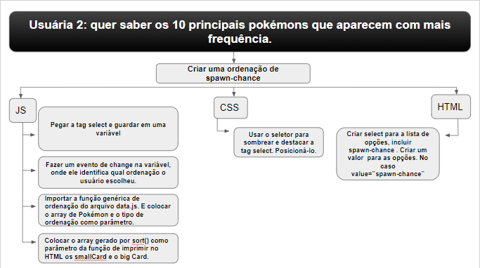
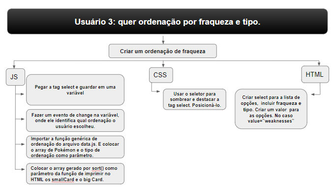
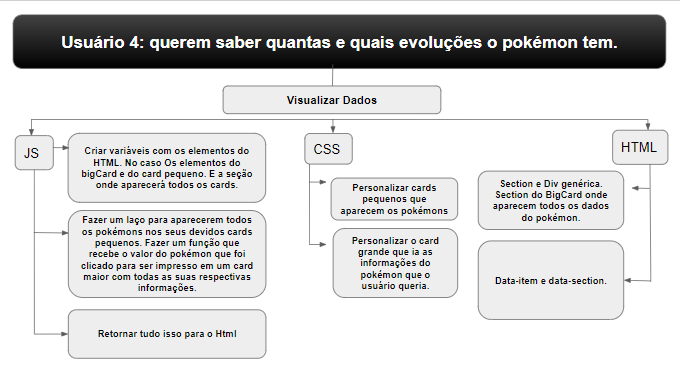
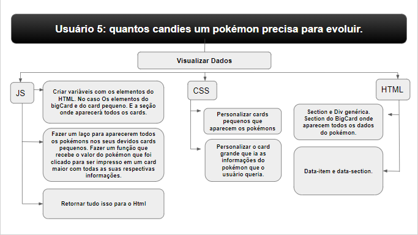
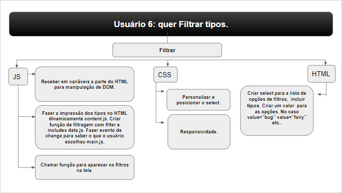
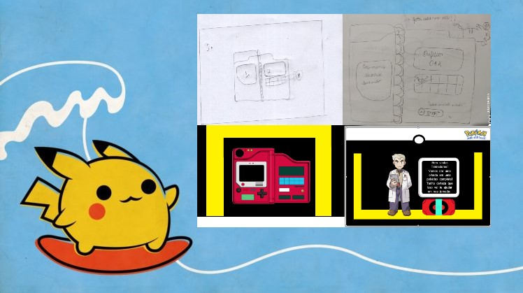
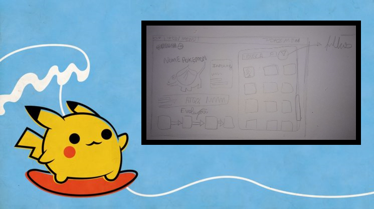
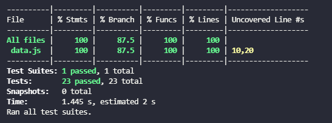

## Índice

- [DATA-LOVERS](#DATA-LOVERS)
- [Resumo do Projeto](#Resumo-do-Projeto)
- [Interface do Usuário](#Interface-do-Usuário)
- [Usuário](#Usuário)
- [Logo](#Logo)
- [Protótipo](#Protótipo)
- [Testes Unitários](#Testes-Unitários)
- [Deploy](#Deploy)
- [Recursos utilizados](#Recursos-utilizados)
- [Autoras](#Autoras)

# DATA-LOVERS

Dados por si só não são considerados informações, em um contexto onde os últimos anos foram os anos que mais geraram dados, precisamos pensar que os mesmos fora de contexto podem confundir usuários que tentam lê-los.

O Projeto Data-Lovers da Laboratória propõe criar uma interface e trabalhar com esses dados soltos para que os dados virem informações legíveis por usuários na internet.

# Resumo do Projeto

No nosso segundo projeto, denominado data-lovers, tivemos a chance de escolher o tema de dados que iriamos trabalhar e optamos por um projeto baseado em Pokemon em razão de grande afinidade.

Neste projeto trabalhamos com um banco de dados robusto, manipulação de objetos dentro de arrays e matrizes de arrays.

Inicialmente, utilizamos as histórias de usuário fornecidas pela Laboratória e com base nesses dados traçamos as estratégias necessárias para melhorar a experiência dos usuários e atender suas expectativas. Após essa etapa criamos uma série de tarefas para atingir os objetivos determinados pelos usuários.

Criamos também protótipos e nos organizamos através do trello. Os protótipos foram utilizados para recolher avaliações de possíveis usuários bem como seus feedbacks.

# Interface do Usuário

1. Mostra os dados em uma interface: em cards;
2. Permite ao usuário interagir com a interface para obter as informações que
   necessita;
3. Permite ao usuário fazer uma filtragem por tipo e nome;
4. Permite ao usuário ordenar de A-Z, Z-A, por Chance de Spawn, Fraqueza e Numeração;
5. Permite ao usuário visualizar a porcentagem dos tipos e raridade.
6. A interface é responsiva;
7. O aplicativo Web possui dua páginas interativas: homepage e a pokédex.

## Usuário

O universo pokémon foi criado em 1995 e ainda atualmente é visto como uma "febre mundial" que cresceu ainda mais com a criação da franquia de Pokémon Go responsável por trazer o mundo dos monstrinhos para a interface dos dispositivos móveis, ampliando ainda mais o público alvo.

Desta forma, o presente aplicativo web é destinado a usuários de todas as idades que acompanham tanto a franquia de games quanto as séries de Pokémon. Também é destinado a novos usuários, tendo como principal objetivo proporcionar uma experiência única e divertida para todos incluindo também a sensação de nostalgia por tratar-se de uma interface intuitiva e relativamente simples por remeter ao padrão de formatação dos games de Gameboy Color com botões e overflow que lembram o Windows 98.

# Logo
O logo foi pensado e construído para que remetece a uma enciclopédia e ao jogo Pokémon GO.

## Protótipo

O Protótipo inicial da surgiu da ideia de criar uma interface que parecesse uma pokédex.

Favicon.

Página 1, protótipo de baixa fidelidade.

Página 2, protótipo de baixa fidelidade.

Página 1, protótipo de alta fidelidade.

Página 2, protótipo de alta fidelidade.

Cards da página 2.

Após os primeiros protótipos saírem pedimos opiniões de usuários fãs de Pokémons, a maioria relatou que os protótipos inicias estavam indo na direção certa, e indicaram o que gostariam de ver em um site relacionado ao tema:
- Cores das pokébolas;
- Algo mais limpo e fácil de achar os dados para o jogo.

Nos últimos protótipos de baixa fidelidade definimos a ideia que seguiriamos para o protótipo final.
A tela inicial tem a cor de uma pokébola, já a segunda tela tem as cores da pokédex.
Trouxemos um personagem na tela inicial que poderia causar nostálgia aos fãs de Pokémon.

# Testes Unitários
Criamos os testes unitários para o arquivo data.js.

# Deploy

Este projeto está disponível para utilização e visualização online através do seguinte endereço web (URL):

- https://monicaguimaraes.github.io/SAP007-data-lovers/

Para utilizar este endereço web (URL) o usuário deverá ter instalado em seu dispositivo um navegador web (Google Chrome, Mozilla Firefox, Internet Explorer e outros).

Acessando o endereço web (URL) o usuário já estará apto a utilizar todas as funcionalidades disponíveis.

# Recursos utilizados

- Java Script Vanilla
- CSS
- HTML

# Autoras

- [@natalieiss](https://github.com/natalieiss) > Natalie I. S. Santos
- [@MonicaGuimaraes](https://github.com/MonicaGuimaraes) > Mônica Peixoto Guimarães

## 🔗 Links

[Figma](https://www.figma.com/file/iv7o2sToNyL6ipwWTlEVkg/Untitled?node-id=0%3A1)
[Trello](https://trello.com/b/ZA9JRYyk/projeto-2-data-lovers-pokemon)
